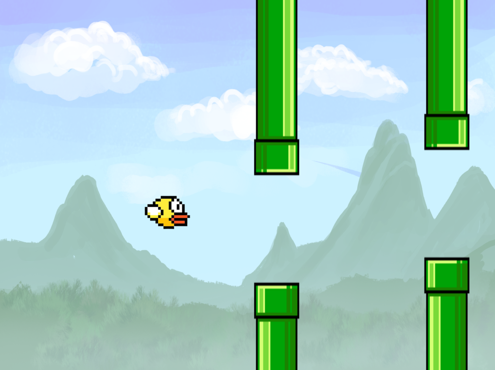
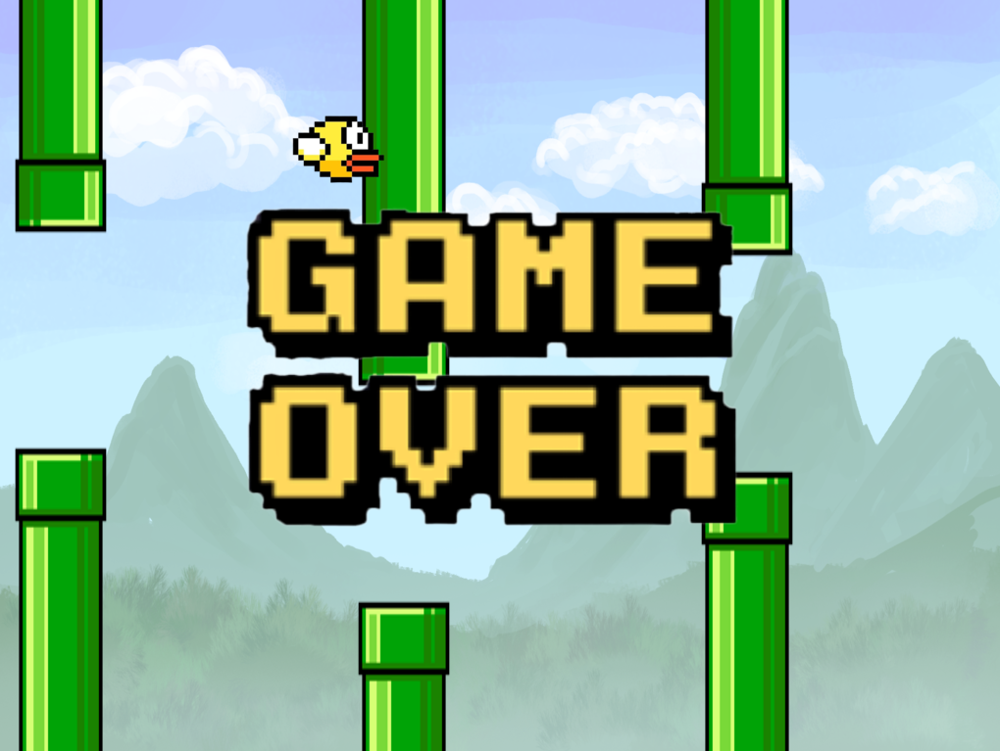

# Flappy Bird

Это вариант игры Flappy Bird, реализованный с использованием предоставленного фреймворка. Игрок управляет полётом птицы между рядами труб, нажимая на пробел, стараясь избежать столкновений. 

После конца игры ее можно перезапустить, нажав на пробел.

## Запуск

В Release сборке собирается файл FlappyBird.exe и помещается в корневую директорию проекта.
Изображения загружаются из папки media:
- bird.png
- tube-top.png
- tube-bottom.png
- game_over.png

## Про код

Я попробовал сделать собственную систему компонентов у каждого GameObject.
Я имею некоторый опыт написания приложений и игр на c++ и при такой архитектуре
было значительно проще добавлять новые фичи по сравнению с моими предыдущими проектами.

## Автор

Зотов Владислав Михайлович

https://github.com/Hramzik?tab=repositories

https://t.me/The_Eclipse69

МФТИ, 2024

## Скриншоты
 

  
  

